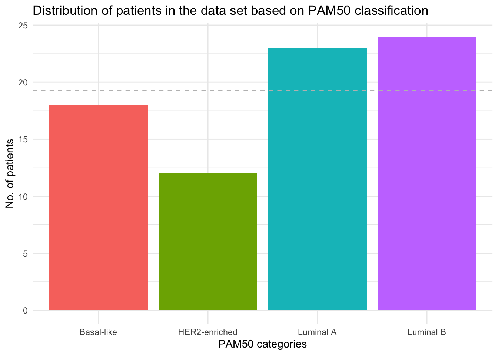

# Introduction to the data

The data is derived from a proteogenomic study investigating how DNA mutations affect the expression of the proteins in breast cancer tissue in patients. When DNA is changing it has an impact on the proteome i.e., the functional molecular part of the organisms. In this context the proteins are responsible for enzymatic reactions / signalling, and they are controlling cell division, and DNA repair, etc.

The dataset contains information on TCGA ID (Clinical Proteomic Tumour Analysis Consortium; NCI/NIH), RefSeq_accession_number (RefSeq database), and from the Uniprot database following variables were available: Entry name, Protein name, Gene symbol, Gene name, Organism (Homo Sapiens), and Length. Finally, datasets contain information on breast cancer TNM classification (AJCC), tumour receptor status for oestrogen, progesterone, and HER2 - incl conversion of receptor status (influencing treatment effect and survival), survival, and, importantly for our focus in the following project, PAM50 (Prediction Analysis of Microarray 50) classification.

PAM50 classification is based on a gene signature of 50 genes considered representative of different biological pathways and molecular features. It is used in breast-cancer research to categorize tumors based on microarray or RNA-sequencing data. The four classifications are:

-   Luminal A

-   Luminal B

-   HER2-enriched

-   Basal-like

In the present study, iTRAQ proteome profiling was performed on 77 breast cancer samples each generally expressing around 12.000 proteins. The protein data was divided by use of K-means clustering into groups with different breast cancer subtypes expressing unique protein signatures.

## Project aim

In this project, we wanted to see how well the proteome profiling relates to the PAM50 classification.

\
To show the distribution of how the 77 samples in the data set were classified by the PAM50 a simple plot was made.


::: {.cell}
::: {.cell-output .cell-output-stderr}
```
── Attaching core tidyverse packages ──────────────────────── tidyverse 2.0.0 ──
✔ dplyr     1.1.3     ✔ readr     2.1.4
✔ forcats   1.0.0     ✔ stringr   1.5.0
✔ ggplot2   3.4.3     ✔ tibble    3.2.1
✔ lubridate 1.9.2     ✔ tidyr     1.3.0
✔ purrr     1.0.2     
── Conflicts ────────────────────────────────────────── tidyverse_conflicts() ──
✖ dplyr::filter() masks stats::filter()
✖ dplyr::lag()    masks stats::lag()
ℹ Use the conflicted package (<http://conflicted.r-lib.org/>) to force all conflicts to become errors
```
:::
:::


A barplot was chosen for visualisation:


::: {.cell}

```{.r .cell-code}
barplot <- ggplot(data = clinical_data, 
                  mapping = aes(x = pam50)) +
  geom_bar(aes(fill = pam50)) +
  theme_minimal() +
  theme(legend.position = "none") +
  labs(title = "Distribution of patients in the data set based on PAM50 classification",
       x = "PAM50 categories",
       y = "No. of patients") +
  geom_hline(yintercept = 19.25, linetype = "dashed", color = "grey")# horisontal line to show an equal distribution

barplot
```

::: {.cell-output-display}
{width=672}
:::

```{.r .cell-code}
ggsave("../results/pam50distribution.png", barplot, height = 4, width = 6)
```
:::


From the barplot it is evident, that the patients are fairly evenly distributed with the HER2-enriched category being under-represented and both the Luminal A and B slightly over what would be completely even distribution.


